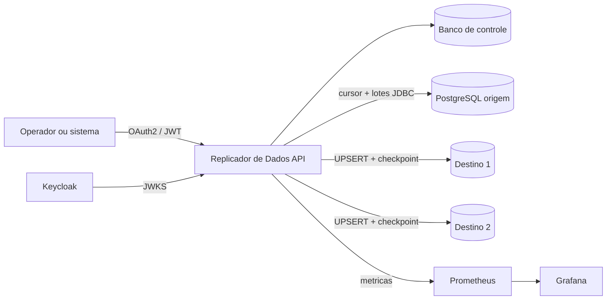

# Replicador de Dados

[](https://github.com/Mateusmith/replicador-dados/actions/workflows/ci.yml)
[](https://openjdk.org/projects/jdk/21/)
[](https://spring.io/projects/spring-boot)
[](https://www.postgresql.org/)
[](LICENSE)

Servico backend para replicacao controlada, incremental e retomavel de tabelas PostgreSQL para multiplos destinos.

O Replicador de Dados resolve um problema comum em integracoes empresariais: copiar dados operacionais para bancos independentes sem duplicar execucoes, perder o ponto de retomada ou interromper todos os destinos quando apenas um deles falha. A demonstracao replica `clientes` antes de `pedidos`, preservando a chave estrangeira entre as tabelas.

O nome publico do produto e **Replicador de Dados**. Os prefixos tecnicos `DATARELAY_*`, o pacote `com.datarelay`, o realm `datarelay` e as metricas `datarelay_*` foram preservados para manter compatibilidade com ambientes existentes.

## Destaques tecnicos

- Java 21 e Spring Boot 3.5
- API REST protegida como OAuth2 Resource Server
- Keycloak com Authorization Code + PKCE e Client Credentials
- cargas completas e incrementais por cursor `(atualizado_em, id)`
- `UPSERT` idempotente e checkpoint monotono por tabela e destino
- trava distribuida PostgreSQL: um plano nao executa em paralelo
- retomada automatica de trabalhos interrompidos apos reinicio
- reprocessamento exclusivo do destino que falhou
- validacao previa de tabelas, colunas, tipos, chaves e dependencias
- isolamento de falhas entre destinos
- agendamento cron, cancelamento em fila e historico persistente
- Flyway, Actuator, Prometheus, Grafana e id de correlacao
- testes unitarios, seguranca e ponta a ponta com Testcontainers
- Docker Compose, OpenAPI, Postman e GitHub Actions

## Arquitetura



O banco de controle armazena configuracoes, execucoes, tentativas por destino e checkpoints. As senhas dos bancos nao sao persistidas: cada conector guarda apenas uma referencia como `env:DATARELAY_SENHA_ORIGEM`.

Detalhes: [arquitetura](docs/ARCHITECTURE.md) e [ADR 0001](docs/adr/0001-controlled-jdbc-replication.md).

## Inicio rapido

### Requisitos

- Docker Desktop com Docker Compose
- portas `8080`, `18081` e `54320` a `54323` livres
- PowerShell 7 recomendado para o roteiro automatizado

Nao e necessario instalar Java ou Maven para executar a demonstracao.

### 1. Iniciar

```powershell
git clone https://github.com/Mateusmith/replicador-dados.git
cd replicador-dados
docker compose up --build --detach
docker compose ps
```

Espere todos os servicos com healthcheck aparecerem como `healthy`.

| Servico | Endereco ou porta |
|---|---|
| API | http://localhost:8080 |
| Swagger UI | http://localhost:8080/swagger-ui.html |
| Keycloak | http://localhost:18081 |
| Banco de controle | `localhost:54320` |
| Banco de origem | `localhost:54321` |
| Banco de destino 1 | `localhost:54322` |
| Banco de destino 2 | `localhost:54323` |

### 2. Executar o teste real da API

```powershell
./scripts/test-api.ps1
```

O roteiro autentica no Keycloak, cria tres conectores, valida os esquemas, cria o plano, executa a carga e confirma `2 clientes + 2 pedidos` em cada destino.

Saida esperada:

```text
Status          : CONCLUIDA
LinhasEscritas  : 8
DestinoUm       : 2:2
DestinoDois     : 2:2
```

### 3. Iniciar observabilidade opcional

```powershell
docker compose --profile observability up --build --detach
```

| Ferramenta | Endereco | Credenciais locais |
|---|---|---|
| Prometheus | http://localhost:19090 | sem autenticacao |
| Grafana | http://localhost:13000 | `admin` / `datarelay` |

O dashboard **Replicador de Dados - Operacao** e provisionado automaticamente.

## Autenticacao

Credenciais existentes apenas para o ambiente local:

| Uso | Cliente/usuario | Segredo/senha |
|---|---|---|
| Swagger com PKCE | `operador` | `datarelay` |
| Identidade de maquina | `datarelay-cli` | `datarelay-cli-secret` |
| Administracao do Keycloak | `admin` | `admin` |

Obter token no PowerShell:

```powershell
$token = (Invoke-RestMethod -Method Post `
  -Uri 'http://localhost:18081/realms/datarelay/protocol/openid-connect/token' `
  -ContentType 'application/x-www-form-urlencoded' `
  -Body @{
    client_id='datarelay-cli'
    client_secret='datarelay-cli-secret'
    grant_type='client_credentials'
  }
).access_token

$headers = @{ Authorization = "Bearer $token" }
```

Escopos:

- `datarelay.leitura`: consultas `GET`
- `datarelay.escrita`: criacao, atualizacao, validacao e execucao

## Fluxo manual da API

Todos os corpos prontos ficam em [`docs/examples`](docs/examples). Substitua os UUIDs de exemplo pelos valores devolvidos pela API.

### Criar os conectores

`POST /api/v1/conectores`

```json
{
  "nome": "origem-pedidos",
  "papel": "ORIGEM",
  "urlJdbc": "jdbc:postgresql://banco-origem:5432/origem",
  "usuario": "origem",
  "referenciaSegredo": "env:DATARELAY_SENHA_ORIGEM"
}
```

Repita com os JSONs [destino 1](docs/examples/target-one-connector.json) e [destino 2](docs/examples/target-two-connector.json). Teste cada conexao:

```http
POST /api/v1/conectores/{conectorId}/teste-conexao
Authorization: Bearer {token}
```

### Criar o plano

`POST /api/v1/planos`

```json
{
  "nome": "replicacao-pedidos",
  "conectorOrigemId": "UUID_ORIGEM",
  "idsConectoresDestino": ["UUID_DESTINO_UM", "UUID_DESTINO_DOIS"],
  "modoPadrao": "INCREMENTAL",
  "tamanhoLote": 500,
  "expressaoCron": "0 */5 * * * *",
  "mapeamentos": [
    {
      "esquemaOrigem": "public",
      "tabelaOrigem": "clientes",
      "esquemaDestino": "public",
      "tabelaDestino": "clientes",
      "colunaChave": "id",
      "colunaIncremental": "atualizado_em",
      "colunas": ["id", "nome", "email", "atualizado_em"]
    },
    {
      "esquemaOrigem": "public",
      "tabelaOrigem": "pedidos",
      "esquemaDestino": "public",
      "tabelaDestino": "pedidos",
      "colunaChave": "id",
      "colunaIncremental": "atualizado_em",
      "colunas": ["id", "cliente_id", "total", "status", "atualizado_em"]
    }
  ]
}
```

A ordem e intencional: `clientes` precisa ser gravada antes de `pedidos`.

### Validar o esquema

```http
POST /api/v1/planos/{planoId}/validacao-esquema
Authorization: Bearer {token}
```

Resposta esperada:

```json
{
  "valido": true,
  "erros": []
}
```

### Executar uma carga completa

```http
POST /api/v1/planos/{planoId}/execucoes
Authorization: Bearer {token}
Idempotency-Key: carga-inicial-2026-08-16
Content-Type: application/json

{
  "modo": "COMPLETA"
}
```

A resposta `202 Accepted` possui o `id` da execucao. Repetir a mesma `Idempotency-Key` devolve a mesma execucao e nao cria trabalho duplicado.

```http
GET /api/v1/execucoes/{execucaoId}
Authorization: Bearer {token}
```

### Executar uma carga incremental

Altere um registro na origem e atualize obrigatoriamente `atualizado_em`:

```powershell
docker compose exec banco-origem psql -U origem -d origem -c `
  "UPDATE pedidos SET status='ENVIADO', atualizado_em=NOW() WHERE id=1"
```

Depois envie [o JSON incremental](docs/examples/incremental-run.json) com uma nova chave idempotente.

### Reprocessar somente um destino com falha

```http
POST /api/v1/execucoes/{execucaoOriginalId}/destinos/{destinoId}/reprocessamentos
Authorization: Bearer {token}
Idempotency-Key: reprocessamento-destino-um-001
Content-Type: application/json

{
  "modo": "COMPLETA"
}
```

Use `COMPLETA` quando o destino perdeu uma tabela ou dados anteriores. O reprocessamento registra a execucao original e nao repete destinos que ja concluiram.

### Cancelar uma execucao na fila

```http
POST /api/v1/execucoes/{execucaoId}/cancelamento
Authorization: Bearer {token}
```

O cancelamento e aceito apenas enquanto o status for `NA_FILA`.

### Ativar ou desativar recursos

O corpo [activation.json](docs/examples/activation.json) e aceito por:

```http
PATCH /api/v1/conectores/{id}/ativacao
PATCH /api/v1/planos/{id}/ativacao
```

Planos em execucao nao podem ser alterados. Conectores usados por um plano ativo tambem ficam protegidos contra mudancas acidentais.

## Endpoints

| Metodo | Endpoint | Finalidade |
|---|---|---|
| `POST` | `/api/v1/conectores` | criar conector |
| `GET` | `/api/v1/conectores` | listar conectores |
| `GET` | `/api/v1/conectores/{id}` | consultar conector |
| `PUT` | `/api/v1/conectores/{id}` | atualizar conector |
| `PATCH` | `/api/v1/conectores/{id}/ativacao` | ativar/desativar |
| `POST` | `/api/v1/conectores/{id}/teste-conexao` | testar JDBC real |
| `POST` | `/api/v1/planos` | criar plano |
| `GET` | `/api/v1/planos` | listar planos |
| `GET` | `/api/v1/planos/{id}` | consultar plano |
| `PUT` | `/api/v1/planos/{id}` | substituir configuracao |
| `PATCH` | `/api/v1/planos/{id}/ativacao` | ativar/desativar |
| `POST` | `/api/v1/planos/{id}/validacao-esquema` | validar bancos |
| `POST` | `/api/v1/planos/{id}/execucoes` | iniciar carga |
| `GET` | `/api/v1/planos/{id}/execucoes` | listar historico |
| `GET` | `/api/v1/execucoes/{id}` | acompanhar execucao |
| `POST` | `/api/v1/execucoes/{id}/cancelamento` | cancelar em fila |
| `POST` | `/api/v1/execucoes/{id}/destinos/{destinoId}/reprocessamentos` | repetir destino falho |

## Postman

Importe [`postman/ReplicadorDados.postman_collection.json`](postman/ReplicadorDados.postman_collection.json) e execute **Run collection**. Nenhum environment externo e necessario.

A colecao autentica, cria os conectores, testa JDBC, cria e valida o plano, executa a carga, aguarda o processamento, comprova idempotencia e consulta o historico.

## Bancos locais

| Banco | Host | Banco/usuario/senha |
|---|---|---|
| Controle | `localhost:54320` | `datarelay_controle` / `datarelay` / `datarelay` |
| Origem | `localhost:54321` | `origem` / `origem` / `origem` |
| Destino 1 | `localhost:54322` | `destino` / `destino` / `destino` |
| Destino 2 | `localhost:54323` | `destino` / `destino` / `destino` |

Verificar registros sem cliente SQL:

```powershell
docker compose exec banco-destino-um psql -U destino -d destino -c `
  "SELECT * FROM clientes; SELECT * FROM pedidos;"
```

## Testes e qualidade

Com Java 21 configurado em `JAVA_HOME`:

```powershell
./mvnw.cmd test
./mvnw.cmd verify
```

Sem Java instalado, execute no container Maven:

```powershell
docker run --rm `
  -e TESTCONTAINERS_HOST_OVERRIDE=host.docker.internal `
  -v /var/run/docker.sock:/var/run/docker.sock `
  -v "${PWD}:/workspace" -w /workspace `
  maven:3.9.11-eclipse-temurin-21 `
  mvn -B --no-transfer-progress `
    "-Djacoco.dataFile=/tmp/datarelay-jacoco.exec" verify
```

O arquivo de execucao do JaCoCo vai para `/tmp` nesse comando para evitar lentidao de escrita em volumes do Docker Desktop no Windows. O relatorio HTML continua sendo gerado em `target/site/jacoco`.

`verify` cobre carga completa, incremental, duas tabelas relacionadas, dois destinos, idempotencia, checkpoint monotono, falha parcial e reprocessamento exclusivo.

## Estrutura

```text
src/main/java/com/datarelay
|-- connector       conectores e referencias de segredo
|-- plan            planos, mapeamentos e agendamento
|-- execution       fila, trava, retomada e historico
|-- replication     validacao de esquema e motor JDBC
`-- shared          erros RFC 9457, correlacao e SQL seguro

docker              bancos, Keycloak e observabilidade
docs                arquitetura, ADRs e exemplos JSON
postman             colecao ponta a ponta
scripts             teste real e reinicializacao da demonstracao
```

## Consistencia e limites

- A versao 1 aceita PostgreSQL e chaves primarias `SMALLINT`, `INTEGER` ou `BIGINT`.
- A coluna incremental deve ser `TIMESTAMP`/`TIMESTAMPTZ`, `NOT NULL` e atualizada pela origem.
- Cada lote e confirmado antes do checkpoint; uma queda pode repetir o lote, mas o `UPSERT` torna isso seguro.
- O modo completo faz `UPSERT` de toda a origem, sem remover linhas exclusivas do destino.
- Exclusoes fisicas exigem tombstone, outbox ou CDC e nao sao inferidas.
- Transformacoes de colunas e replicacao por WAL pertencem a uma evolucao posterior.

## Reiniciar a demonstracao

```powershell
./scripts/reset-demo.ps1
```

Atencao: esse script remove os volumes Docker do projeto e todos os dados locais de demonstracao.

## Contribuicao e seguranca

- [Como contribuir](CONTRIBUTING.md)
- [Politica de seguranca](SECURITY.md)
- [Historico de versoes](CHANGELOG.md)

As credenciais deste README existem somente para a pilha local. Nao use os mesmos valores fora do ambiente de demonstracao.

## Licenca

Distribuido sob a [licenca MIT](LICENSE).
